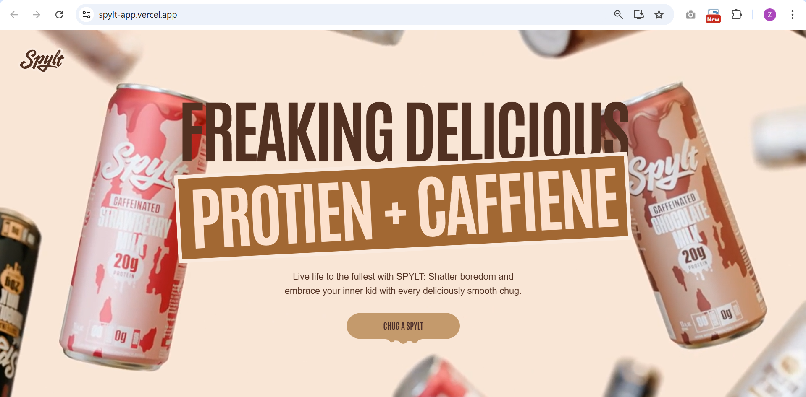

# 🌀 Spylt Website  
A fully responsive and animated clone of the official **Spylt** website, built using **React, GSAP, TailwindCSS, and JSX**.

🚀 **Live Demo:** https://spylt-app.vercel.app/  
📦 **GitHub Repo:** https://github.com/Zartasha-kanwal/spylt-app  

---

## 📸 Project Demo  
Here’s a quick look at the cloned Spylt homepage:



---

## 📌 Overview  
This project is a pixel-close recreation of the **Spylt** homepage.  
It includes smooth GSAP animations, responsive layouts, and optimized visual assets — closely matching the original website.

This clone was built to sharpen front-end development skills and demonstrate capabilities in animation, responsive UI, and component-based architecture.

---

## 🛠️ Tech Stack

- **React.js**(Create React App)
- **TailwindCSS**
- **GSAP (GreenSock Animation Platform)**
- **JSX**
- **Responsive Design**

---

## ✨ Features

### 🎨 Pixel-Close UI  
Recreated the modern and vibrant UI of Spylt with precision.

### 🌀 GSAP Animations  
Smooth entrance animations, scroll-triggered effects, staggered text, and parallax motion.

### 📱 Fully Responsive  
Looks great on:
- Mobile  
- Tablet  
- Desktop  

### ⚡ High Performance  
Optimized media, lightweight components, and smooth rendering.

---

---

## 🚀 Run Locally

```bash
git clone https://github.com/Zartasha-kanwal/spylt-app.git
cd spylt-app
npm install
npm run dev

🧑‍💻 Author

Zartasha Kanwal
Frontend Developer

📄 Disclaimer

This project is for educational and portfolio purposes only.
All branding, design rights, and assets belong to Spylt.
